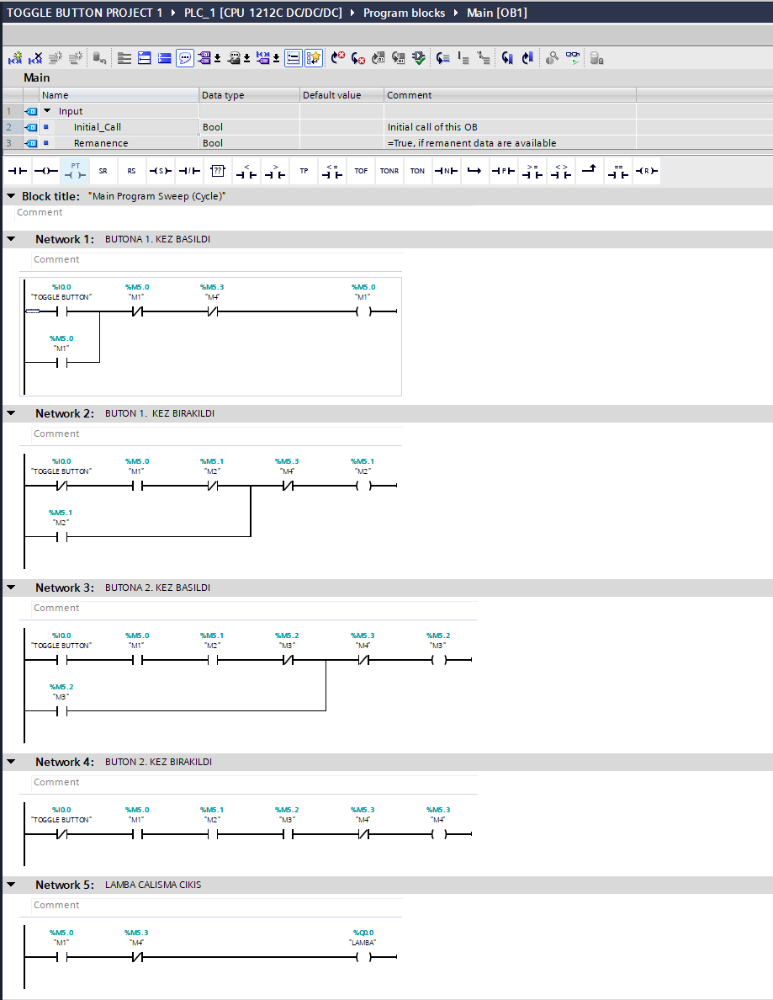

# PLC Toggle Button Uygulaması

Bu projede Siemens S7-1200 PLC ve TIA Portal V18 kullanılarak memory bitleri ile çalışan bir Toggle Button uygulaması gerçekleştirilmiştir. Tek bir butona art arda basılarak çıkışın açılıp kapatılması sağlanmıştır.

## Kullanılan Teknolojiler

- Siemens S7-1200 PLC
- TIA Portal V18
- Ladder (LAD)
- Memory bitleri

## Program Yapısı

### Network 1 – Butona 1. Kez Basıldı

Toggle butonuna ilk kez basıldığında M1 biti aktif edilir. M1 biti mühürleme mantığı ile kendi durumunu korur. Diğer memory bitleri kullanılarak programın çalışma sırası kontrol edilir.

### Network 2 – Buton 1. Kez Bırakıldı

Buton bırakıldığında M2 biti aktif edilir. Bu bit, ilk basma işleminin tamamlandığını hafızada tutarak ikinci basma aşamasına geçilmesini sağlar.

### Network 3 – Butona 2. Kez Basıldı

Toggle butonuna ikinci kez basıldığında M3 biti aktif edilir. Böylece sistem çıkışın kapatılması için gerekli ikinci basma durumunu algılar.

### Network 4 – Buton 2. Kez Bırakıldı

Buton ikinci kez bırakıldığında M4 biti aktif edilir. Bu durum toggle çevriminin tamamlanmasını sağlar ve sistem yeni bir çevrim için hazırlanır.

### Network 5 – Lamba Çıkışı

Memory bitlerinin durumuna bağlı olarak Q0.0 "LAMBA" çıkışı kontrol edilir. İlk buton basma işleminde lamba aktif olur, ikinci buton basma işleminden sonra lamba devre dışı kalır.

## Proje Dosyası

Repository içerisinde TIA Portal V18 ile oluşturulmuş `.zap18` proje arşivi bulunmaktadır.

## Ladder Diyagramı

Programın Ladder diyagramı aşağıda gösterilmektedir.

